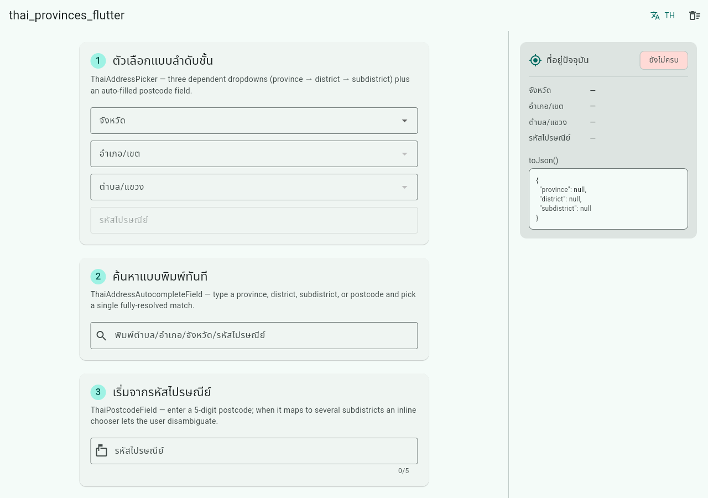

# thai_provinces_flutter

Cascading Thai address picker widgets — จังหวัด → อำเภอ/เขต → ตำบล/แขวง + รหัสไปรษณีย์ — for Flutter, with **no state-management lock-in** and **no code generation**.

[](https://pub.dev/packages/thai_provinces_flutter)
[](https://pub.dev/packages/thai_provinces_flutter/score)
[](https://pub.dev/packages/thai_provinces_flutter/score)
[](LICENSE)

A drop-in province → district → subdistrict picker that auto-fills the postcode, speaks Thai or English, and plugs straight into a Flutter `Form`.

**▶ [Live demo](https://ultramcu.github.io/thai_provinces_flutter.dart/)** — every widget in this package, running in your browser.



## Install

```sh
flutter pub add thai_provinces_flutter
```

This pulls in exactly two things: `flutter` and the [`thai_provinces`](https://pub.dev/packages/thai_provinces) data core. Nothing else.

## Why this package

A drop-in Thai address picker with a deliberately small footprint:

- **No state-management lock-in** — no provider / riverpod / bloc. Selection state lives in a plain `ValueNotifier` (`ThaiAddressController`). Use it with whatever you already use.
- **No code generation** — no freezed / json_serializable / build_runner. Just import and run.
- **Built on a verified data core** — all 77 provinces, 928 districts and 7,452 subdistricts come from [`thai_provinces`](https://pub.dev/packages/thai_provinces) (160/160 pub points), DOPA-validated.
- **Form-native** — `ThaiAddressFormField` integrates with `Form`, `validator`, `onSaved` and error display out of the box.

The core models (`Province`, `District`, `Subdistrict`) and lookup helpers (`provinces()`, `provinceByCode()`, …) are **re-exported**, so a single import gives you everything.

### At a glance

| Capability | `thai_provinces_flutter` |
| --- | --- |
| Cascading province → district → subdistrict picker | `ThaiAddressPicker` |
| Single type-ahead field | `ThaiAddressAutocompleteField` |
| Postcode reverse-lookup | `ThaiPostcodeField` / `controller.setPostcode` |
| `Form` validation field | `ThaiAddressFormField` + `ThaiAddressValidators` |
| Custom per-level fields / labels | `fieldBuilder` / `labelBuilder` |
| Styling | theme, per-field `decoration`, direct passthrough (`dropdownColor`/`style`/…) |
| Languages | Thai / English / bilingual (`ThaiAddressLanguage`) |
| Runtime dependencies | `flutter` + `thai_provinces` only |
| Code generation | none |
| State-management lock-in | none (plain `ValueNotifier`) |

## Minimal example

A picker inside a `Form`, reporting changes through `onChanged`:

```dart
import 'package:flutter/material.dart';
import 'package:thai_provinces_flutter/thai_provinces_flutter.dart';

class AddressForm extends StatelessWidget {
  const AddressForm({super.key});

  @override
  Widget build(BuildContext context) {
    return Form(
      child: ThaiAddressPicker(
        onChanged: (sel) {
          debugPrint('province=${sel.province?.nameTh} postcode=${sel.postcode}');
        },
      ),
    );
  }
}
```

## Controller-driven example

Own a `ThaiAddressController` to read, drive, or clear the selection. `onChanged`
fires for **both** dropdown taps and programmatic `controller.setX()` calls — it is
the single source of truth.

```dart
final controller = ThaiAddressController();

ThaiAddressPicker(
  controller: controller,
  onChanged: (sel) => print(sel.toJson()),
);

// Drive it programmatically (cascade-clears the levels below):
controller.setProvince(provinceByCode(10)); // Bangkok
controller.clear();

// Read the current values:
final code = controller.subdistrict?.postcode;
```

## Form field + validator example

Require a complete address before the form will submit:

```dart
final formKey = GlobalKey<FormState>();

Form(
  key: formKey,
  child: Column(
    children: [
      ThaiAddressFormField(
        autovalidateMode: AutovalidateMode.onUserInteraction,
        validator: (sel) =>
            (sel == null || !sel.isComplete) ? 'Please choose a full address' : null,
        onSaved: (sel) => submit(sel!),
      ),
      ElevatedButton(
        onPressed: () {
          if (formKey.currentState!.validate()) {
            formKey.currentState!.save();
          }
        },
        child: const Text('Submit'),
      ),
    ],
  ),
);
```

## Autocomplete (type-ahead)

`ThaiAddressAutocompleteField` resolves a free-text query — a Thai or English
subdistrict / district / province name, or a postcode prefix — to a full
selection in a single field. Picking a suggestion cascades into the controller,
so `onChanged` reports the same `ThaiAddressSelection` as the picker does.

```dart
import 'package:flutter/material.dart';
import 'package:thai_provinces_flutter/thai_provinces_flutter.dart';

class AddressSearch extends StatelessWidget {
  const AddressSearch({super.key});

  @override
  Widget build(BuildContext context) {
    return ThaiAddressAutocompleteField(
      decoration: const InputDecoration(labelText: 'ค้นหาที่อยู่'),
      maxOptions: 10,
      onChanged: (sel) =>
          debugPrint('${sel.subdistrict?.nameTh} ${sel.postcode}'),
    );
  }
}
```

## Postcode field (reverse lookup)

`ThaiPostcodeField` is postcode-first: the user types a 5-digit code and the
address auto-fills as far as the postcode is unambiguous — the province and
district are set only when *every* matching subdistrict shares them (most
postcodes do, but ~18% span several districts and a few span several provinces),
and the subdistrict is filled when the postcode is 1:1. When several
subdistricts share the code, the field shows an inline chooser so the user picks
one (resolving the whole address). The same logic is available programmatically
via `controller.setPostcode(int)`.

```dart
import 'package:flutter/material.dart';
import 'package:thai_provinces_flutter/thai_provinces_flutter.dart';

class PostcodeEntry extends StatelessWidget {
  const PostcodeEntry({super.key});

  @override
  Widget build(BuildContext context) {
    return ThaiPostcodeField(
      decoration: const InputDecoration(labelText: 'รหัสไปรษณีย์'),
      onChanged: (sel) => debugPrint(
        '${sel.province?.nameTh} / ${sel.district?.nameTh} / '
        '${sel.subdistrict?.nameTh}',
      ),
    );
  }
}

// Or drive a controller directly:
final controller = ThaiAddressController();
controller.setPostcode(10800); // 1:1 → fills แขวงบางซื่อ, เขตบางซื่อ, กรุงเทพฯ
controller.setPostcode(50200); // 1 district, 3 subdistricts → province+district
controller.setPostcode(13240); // spans 2 provinces → nothing pinned; use chooser
```

## Codes (DOPA geocodes)

Every level carries its official DOPA `code` (province 2-digit, district
4-digit, subdistrict 6-digit). Store a single integer per level and rebuild the
selection later with `ThaiAddressSelection.fromCodes` — missing parents are
derived from the deepest code given. `toCodes()` is the inverse and round-trips.

```dart
import 'package:thai_provinces_flutter/thai_provinces_flutter.dart';

// Rebuild from a stored subdistrict code; district + province are derived.
final sel = ThaiAddressSelection.fromCodes(subdistrictCode: 500108);
// sel.province?.code == 50, sel.district?.code == 5001, sel.postcode == 50200

// Inverse: read the codes back out.
final (p, d, s) = sel.toCodes(); // (50, 5001, 500108)
final same = ThaiAddressSelection.fromCodes(
  provinceCode: p,
  districtCode: d,
  subdistrictCode: s,
);
assert(same == sel); // round-trips

// On a live controller:
final controller = ThaiAddressController();
controller.setFromCodes(subdistrictCode: 500108);
```

### Seeding a picker with `initialCodes`

Pass stored codes straight to the picker to pre-select an address on first
build. `initialCodes` is applied once; it never clobbers a supplied controller
that already holds a non-empty selection.

```dart
import 'package:thai_provinces_flutter/thai_provinces_flutter.dart';

// (provinceCode, districtCode, subdistrictCode)
const picker = ThaiAddressPicker(initialCodes: (50, 5001, 500108));

// A deeper-only code works too — parents are derived:
const fromSub = ThaiAddressPicker(initialCodes: (null, null, 500108));
```

## API

| Type | Kind | Purpose |
| --- | --- | --- |
| `ThaiAddressPicker` | Widget | Cascading province/district/subdistrict dropdowns + read-only postcode. Optional `initialCodes` seed. |
| `ThaiAddressAutocompleteField` | Widget | Single type-ahead field resolving a free-text name / postcode-prefix query to a full selection. |
| `ThaiPostcodeField` | Widget | Postcode-first field: 5-digit entry fills the levels the code shares unambiguously, plus an inline subdistrict chooser when several subdistricts match. |
| `ThaiAddressFormField` | `FormField` | `Form`-integrated picker with `validator` / `onSaved` / error text. |
| `ThaiAddressValidators` | Helpers | Ready-made `FormField` validators, e.g. `ThaiAddressValidators.required(...)`. |
| `ThaiAddressFieldScope` / `ThaiAddressLevel` | Builder types | Passed to `fieldBuilder` to render a custom widget per level. |
| `ThaiAddressController` | `ValueNotifier` | Holds the selection; cascade-clearing, guarded setters (`setProvince` / `setDistrict` / `setSubdistrict` / `setPostcode` / `setFromCodes` / `clear`). |
| `ThaiAddressSelection` | Value object | Immutable `{province, district, subdistrict}` snapshot; `postcode`, `isComplete`, `isEmpty`, `copyWith`, `fromCodes` / `toCodes`, `toJson` / `fromJson`, value equality. |
| `ThaiAddressLanguage` | Enum | `thai`, `english` or `bilingual` — picks which label names render. |
| `ThaiAddressLanguageLabels` | Extension | `labelOf` / `labelOfDistrict` / `labelOfSubdistrict` helpers. |
| `Province`, `District`, `Subdistrict` | Re-exported models | From `thai_provinces`. |
| `provinces()`, `provinceByCode()`, … | Re-exported helpers | From `thai_provinces`. |

### Notes

- `ThaiAddressSelection.postcode` is an `int?` (it comes from the core `Subdistrict.postcode`, an `int`); the read-only postcode field stringifies it.
- The controller's setters are **guarded**: passing a district/subdistrict that does not belong to the current parent is a no-op in release builds and trips an `assert` in debug builds, so the held selection is never left inconsistent.
- An external controller you pass in is **never disposed** by the widgets; an internally created one is.

## Language (TH / EN / bilingual)

Set `language:` to one of:

- `ThaiAddressLanguage.thai` (default) — Thai names and default labels
  (จังหวัด / อำเภอ-เขต / ตำบล-แขวง / รหัสไปรษณีย์).
- `ThaiAddressLanguage.english` — romanized names and English labels
  (Province / District / Subdistrict / Postcode).
- `ThaiAddressLanguage.bilingual` — both, rendered as `"<Thai> (<English>)"`,
  e.g. `"กรุงเทพมหานคร (Bangkok)"`.

The *selected values* are language-independent — only the displayed text
changes. A caller-set `decoration.labelText`, or the per-field `provinceLabel` /
`districtLabel` / `subdistrictLabel` / `postcodeLabel` arguments, override the
defaults.

```dart
ThaiAddressPicker(
  language: ThaiAddressLanguage.bilingual, // "กรุงเทพมหานคร (Bangkok)"
);
```

## Validators

`ThaiAddressValidators` gives you ready-made `FormField` validators for a
`ThaiAddressSelection`, so you don't have to hand-roll the `isComplete` check.
`required` passes only when the selection has all three levels and otherwise
returns a message localized to `language` (or your own `message`).

```dart
ThaiAddressFormField(
  autovalidateMode: AutovalidateMode.onUserInteraction,
  // -> "กรุณาเลือกที่อยู่ให้ครบ" (or the EN / bilingual default, or a custom one)
  validator: ThaiAddressValidators.required(
    language: ThaiAddressLanguage.thai,
  ),
);
```

## Custom fields & labels

Two hooks on `ThaiAddressPicker` let you change what each level looks like
without giving up the cascade / clear / postcode logic:

- **`labelBuilder`** overrides just the *text* of each option. It's handed the
  area model (`Province` / `District` / `Subdistrict`); return the string to
  show. Return based on `language` yourself, or ignore it entirely.
- **`fieldBuilder`** is the full escape hatch: return a custom widget for a level
  (an autocomplete, a Cupertino picker, a bottom-sheet trigger, …) and the
  picker uses it in place of the default dropdown. Commit a choice by calling
  `scope.onSelected(option)`; return `null` for a level to keep its default
  dropdown.

```dart
ThaiAddressPicker(
  // Show the DOPA code next to each province name.
  labelBuilder: (area) =>
      area is Province ? '${area.nameTh} (${area.code})' : area.toString(),

  // Replace the province level with a button that opens your own UI.
  fieldBuilder: (context, scope) {
    if (scope.level != ThaiAddressLevel.province) return null; // keep default
    return OutlinedButton(
      onPressed: () async {
        final picked = await showMyProvinceSheet(context, scope.options);
        if (picked != null) scope.onSelected(picked); // drives the cascade
      },
      child: Text(scope.selected == null ? scope.label : '${scope.selected}'),
    );
  },
);
```

## Styling & theming

There are three layers, from broadest to most surgical — use whichever fits.

**1. Ambient `ThemeData`.** Every field here is a standard Material widget
(`DropdownButtonFormField`, `TextField`, `Autocomplete`), so your app theme
already styles them. `ColorScheme`, `InputDecorationTheme` and `DropdownMenuThemeData`
all apply with no per-widget code:

```dart
MaterialApp(
  theme: ThemeData(
    useMaterial3: true,
    colorSchemeSeed: Colors.teal,
    inputDecorationTheme: const InputDecorationTheme(
      border: OutlineInputBorder(),
      filled: true,
    ),
  ),
  home: const AddressForm(), // pickers inherit the teal + outlined look
);
```

**2. Per-field `decoration`.** Pass an `InputDecoration` to set borders, icons,
hints, fill, etc. for this picker only:

```dart
ThaiAddressPicker(
  decoration: const InputDecoration(
    border: OutlineInputBorder(),
    prefixIcon: Icon(Icons.location_on_outlined),
  ),
);
```

**3. Direct dropdown passthrough.** For the dropdown-specific bits that aren't
part of `InputDecoration`, `ThaiAddressPicker` and `ThaiPostcodeField` forward
`style`, `dropdownColor`, `borderRadius`, `icon`, `iconEnabledColor` and
`menuMaxHeight` straight through to the underlying dropdowns
(`ThaiAddressAutocompleteField` forwards `style`). Each defaults to `null` /
the theme:

```dart
ThaiAddressPicker(
  dropdownColor: Colors.teal.shade50,
  borderRadius: BorderRadius.circular(16),
  style: const TextStyle(fontWeight: FontWeight.w600),
  icon: const Icon(Icons.expand_more),
  menuMaxHeight: 320,
);
```

For anything beyond these, `fieldBuilder` (above) is the full escape hatch:
render your own widget for a level and keep the picker's cascade.

## Screenshots

> _Screenshots coming soon._ Run the [`example/`](example/) app to see the picker live:
>
> ```sh
> cd example && flutter run
> ```

## Credits & license

- Data and core models: [`thai_provinces`](https://pub.dev/packages/thai_provinces) — Thai province/district/subdistrict + postal data, DOPA-validated.
- Released under the [MIT License](LICENSE).
